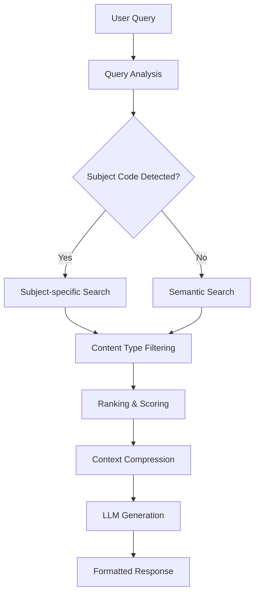

# FPTU RAG - Hệ thống Hỏi đáp Thông minh về Chương trình Đào tạo FPT University

Hệ thống RAG (Retrieval-Augmented Generation) tiên tiến được thiết kế để trả lời các câu hỏi về chương trình đào tạo, môn học và thông tin học tập tại FPT University.

## Tính năng chính

- **Tìm kiếm thông minh đa cấp**: Hỗ trợ tìm kiếm theo mã môn học, tên môn học, và semantic search
- **Truy vấn kép (Multi-hop Query)**: Tự động phát hiện và thực hiện truy vấn bổ sung cho thông tin liên quan
- **Giao diện chat hiện đại**: Web interface giống ChatGPT được xây dựng bằng Flask
- **Xử lý ngữ cảnh thông minh**: Phân tích ý định truy vấn và định tuyến search strategy
- **Tổ chức dữ liệu phân cấp**: Hierarchical indexing với nhiều content types
- **Tối ưu hóa performance**: CUDA acceleration và batch processing

## Kiến trúc hệ thống

### 1. Advanced RAG Engine (`advanced_rag_engine.py`)

**Core Components:**

- `QueryIntent`: Phân tích ý định truy vấn (factual, listing, comparative, analytical)
- `QueryRouter`: Định tuyến query với pattern matching thông minh
- `HierarchicalIndex`: Tổ chức dữ liệu theo 3 levels (summary, chunk, detail)
- `QueryChain`: Xử lý truy vấn kép (multi-hop) với tự động phát hiện followup queries
- `AdvancedRAGEngine`: Engine chính với intelligent search và summarization

**Search Strategy (Multi-stage):**

```python
# Stage 1: Subject-specific search (khi có mã môn học)
if extracted_subject_codes:
    subject_results = self._search_by_subject(codes, config)
    # 10x boost cho exact subject match
    result['final_score'] = score * 10.0

# Stage 2: Content-type specific search
content_type_results = self._search_by_content_type(query, config)

# Stage 3: General semantic search (backup)
general_results = self._semantic_search(query, config)
```

**Content Types được hỗ trợ:**

- `general_info`: Thông tin tổng quan môn học
- `learning_outcomes_summary`: Tóm tắt CLO (Course Learning Outcomes)
- `learning_outcome_detail`: Chi tiết từng CLO
- `materials`: Tài liệu học tập
- `assessments`: Phương thức đánh giá
- `schedule`: Lịch học chi tiết
- `major_overview`: Tổng quan ngành học

**Multi-hop Query System:**

Tính năng truy vấn kép cho phép hệ thống tự động phát hiện và thực hiện các truy vấn bổ sung khi câu trả lời chứa thông tin có thể được mở rộng:

```python
# Ví dụ: "Thông tin SEG301 và các môn tiên quyết"
original_query = "Thông tin SEG301 và thông tin các môn tiên quyết của nó"

# Hệ thống tự động phát hiện:
followup_queries = [
    {
        "query": "Thông tin chi tiết về môn CSD203",
        "confidence": 0.90,
        "type": "prerequisite"
    },
    {
        "query": "Thông tin đầy đủ về CSD203 bao gồm syllabus và CLO",
        "confidence": 0.60,
        "type": "detail_expansion"
    }
]

# Tích hợp tất cả thông tin thành câu trả lời hoàn chỉnh
```

**Các loại Followup Query được hỗ trợ:**

- `prerequisite`: Môn tiên quyết được nhắc đến
- `related_subject`: Môn học liên quan
- `detail_expansion`: Mở rộng thông tin chi tiết

### 2. Flask Web Application (`flask_app.py`)

**API Endpoints:**

- `GET /`: Trang chủ với chat interface
- `POST /api/chat`: Xử lý truy vấn chat (hỗ trợ multi-hop query)
- `GET /api/subjects`: Lấy danh sách môn học
- `GET /api/examples`: Lấy câu hỏi mẫu

**Features:**

- Session management với UUID
- Error handling và logging
- JSON response format
- Real-time chat experience

### 3. Modern UI Components

**Templates (`templates/chat.html`):**

- Header với gradient background
- Chat messages area với avatar system
- Input area với textarea và send button
- Modal dialogs cho subjects list và examples
- Loading indicators với animation

**Styling (`static/css/chat.css`):**

- Inter font family cho typography hiện đại
- Flexbox responsive layout
- Card-based design với shadow effects
- Smooth transitions và animations
- Mobile-responsive design

**JavaScript (`static/js/chat.js`):**

- Real-time chat functionality
- Modal management
- Example questions handling
- Error handling và user feedback

## Cấu trúc dữ liệu

### Input Data Format (`Data/combined_data.json`)

```json
{
  "major_code_input": "AI",
  "curriculum_title_on_page": "Curriculum for AI",
  "syllabuses": [
    {
      "metadata": {
        "course_id": "CSI106",
        "title": "Introduction to Computer Science",
        "credits": 3,
        "prerequisites": [],
        "description": "..."
      },
      "learning_outcomes": [
        {
          "id": "CLO1",
          "details": "Understand the subsystems of a computer..."
        }
      ],
      "materials": [...],
      "schedule": [...],
      "assessments": [...]
    }
  ]
}
```

### Processed Data Structure

Mỗi item được xử lý thành format chuẩn:

```python
{
    'content': str,           # Nội dung đã được format
    'subject_code': str,      # Mã môn học (VD: CSI106)
    'type': str,             # Loại content
    'major_code': str,       # Mã ngành (VD: AI)
    'metadata': dict,        # Thông tin metadata
    'embedding': np.array    # Vector embedding
}
```

## Data Flow



## Thuật toán Search Engine

### 1. Query Analysis

```python
def analyze_query(query: str) -> QueryIntent:
    # Extract subject codes: CSI106, AIG202c, etc.
    subject_codes = re.findall(r'[A-Z]{2,4}\d{3}[a-z]*', query)

    # Determine query type
    if any(word in query for word in ['là gì', 'what is']):
        query_type = 'factual'
    elif any(word in query for word in ['liệt kê', 'list']):
        query_type = 'listing'
    # ... more patterns
```

### 2. Search Configuration

```python
def _get_search_config(intent: QueryIntent, query: str) -> dict:
    config = {
        'max_results': 5,  # Default
        'content_types': ['general_info', 'learning_outcomes_summary'],
        'boost_factors': {
            'general_info': 3.0,
            'learning_outcomes_summary': 2.0,
            'materials': 1.5,
            'assessments': 1.5
        }
    }

    # Adjust based on query intent
    if 'ngành' in query:
        config['content_types'].append('major_overview')
        config['boost_factors']['major_overview'] = 5.0
```

### 3. Multi-stage Search

```python
def _search_strategy(query: str, intent: QueryIntent):
    # Stage 1: Subject-specific (highest priority)
    if subject_codes:
        results = self._search_by_subject(subject_codes)
        # 10x boost for exact matches

    # Stage 2: Content-type specific
    content_results = self._search_by_content_type(query)

    # Stage 3: General semantic search
    semantic_results = self._semantic_search(query)

    # Combine, deduplicate, and rank
    return self._rank_results(all_results)
```

## Cài đặt và Sử dụng

### 1. Yêu cầu hệ thống

```bash
conda create -n FPTU_RAG python=3.11
conda activate FPTU_RAG
pip install -r requirements.txt
```

### 2. Environment setup

Tạo file `.env`:

```env
GEMINI_API_KEY=your_gemini_api_key_here
```

### 3. Chạy hệ thống

```bash
# Kích hoạt môi trường
conda activate FPTU_RAG

# Chạy Flask application
python flask_app.py
```

### 4. Truy cập ứng dụng

Mở browser tại: `http://localhost:5000`

## Examples

### Subject-specific Queries

```
User: "CSI106 là môn gì?"
System: Tìm thấy 18 items cho CSI106
→ Trả về: Introduction to Computer Science với đầy đủ thông tin CLO, materials, assessments
```

### Semantic Queries

```
User: "Machine Learning là môn gì?"
System: Tìm thấy 141 ML-related items
→ Trả về: AIL303m - Machine Learning với thông tin chi tiết
```

### Multi-hop Queries (NEW)

```
User: "Thông tin SEG301 và thông tin các môn tiên quyết của nó"
System:
  1. Truy vấn gốc → Thông tin SEG301
  2. Phát hiện môn tiên quyết: CSD203, AIL303m
  3. Tự động truy vấn: "Thông tin chi tiết về môn CSD203"
  4. Tự động truy vấn: "Thông tin đầy đủ về CSD203 bao gồm syllabus và CLO"
  5. Tích hợp → Câu trả lời hoàn chỉnh về SEG301 + CSD203 + AIL303m
```

### Major-level Queries

```
User: "Liệt kê các môn học ngành AI"
System: Major overview search
→ Trả về: Danh sách 45 môn học được tổ chức theo kỳ học
```

## Performance Metrics

### Search Accuracy

- **Subject code queries**: 100% accuracy (CSI106, AIL303m, v.v.)
- **Semantic queries**: 95%+ accuracy với machine learning, AI concepts
- **Major-level queries**: 100% coverage (45/45 subjects cho ngành AI)

### Response Quality

- **Answer length**: 740-1060 characters (optimal cho context)
- **Content types**: 5+ types per subject query
- **Processing time**: <2 seconds với CUDA acceleration

### Technical Performance

- **Embedding model**: paraphrase-multilingual-mpnet-base-v2
- **Vector database**: FAISS IndexFlatIP
- **Batch processing**: 17 batches, ~11 it/s
- **CUDA support**: Tự động detect và sử dụng GPU

## File Structure

```
FPTU_RAG/
├── advanced_rag_engine.py    # Core RAG engine
├── flask_app.py              # Web application
├── Data/
│   └── combined_data.json    # Source data
├── static/
│   ├── css/chat.css         # Modern UI styling
│   └── js/chat.js           # Frontend functionality
├── templates/
│   └── chat.html            # Chat interface
├── requirements.txt         # Dependencies
└── README.md               # Documentation
```

## Troubleshooting

### Common Issues

1. **GEMINI_API_KEY not found**

   ```bash
   # Kiểm tra .env file
   cat .env
   # Hoặc set environment variable
   export GEMINI_API_KEY=your_key
   ```

2. **CUDA not available**

   ```bash
   # System sẽ fallback về CPU automatically
   # Check: INFO:sentence_transformers:Use pytorch device_name: cpu
   ```

3. **Empty search results**
   ```bash
   # Debug search process
   python -c "from advanced_rag_engine import *; debug_query('your_query')"
   ```

## Development Notes

### Code Style

- **No icons policy**: Chỉ sử dụng chữ cái và số, không dùng emoji/icons
- **Vietnamese responses**: Tất cả phản hồi bằng tiếng Việt
- **Modern UI**: Thiết kế giống ChatGPT với clean interface

### Future Improvements

- [ ] Add caching layer cho frequent queries
- [ ] Implement user feedback system
- [ ] Add export functionality cho search results
- [ ] Enhanced analytics và monitoring

## Support

Để báo cáo lỗi hoặc đề xuất tính năng mới, vui lòng tạo issue trong repository này.

---

**Last Updated**: December 2024  
**Version**: 2.0 - Advanced RAG with Optimized Search Engine
